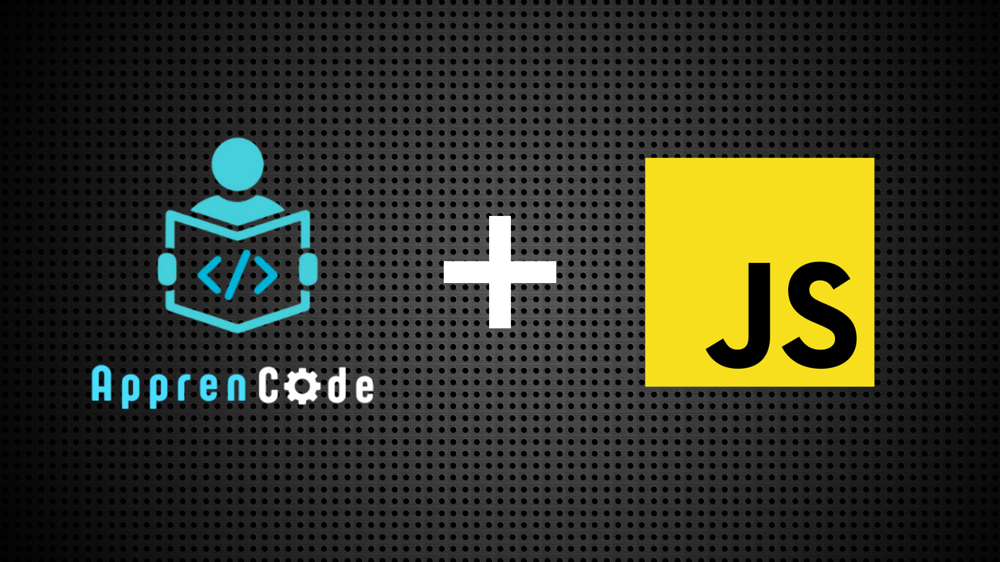

# ApprenCode - JavaScript

<h1>Bem-vindo ao ApprenCode! 🚀🎯</h1>

<h2> 🧠 Sobre o projeto</h2>

O ApprenCode é um projeto pessoal com o objetivo de ajudar iniciantes a treinar JavaScript de forma prática e acessível. Aqui, eu crio pequenos desafios, explicações que mostram na prática, como o JavaScript funciona. A ideia aqui é simples: <strong>aprender fazendo!</strong> ✨

<h2>📌 Objetivo</h2>

Meu foco é dar ideias de projetos simples, interativos e focados em resolução de problemas. A ideia é que qualquer pessoa, mesmo sem experiência, consiga entender os conceitos e praticar com exemplos reais.
E mostrando que a programação não é um bixo de sete cabeças, mas sim uma habilidade que pode ser desenvolvida com prática e dedicação. 👨‍💻

<h2>🛠️ Tecnologias utilizadas</h2>

🌐 HTML

🎨 CSS

⚙️ JavaScript

<h2>🧩 Por que crie esse projeto?</h2>

Eu sempre tive interesse em programação e eu arquivava o que eu fazia e tive a ideia de compartilhar aquilo que eu criava e ajudar as pessoas que também quer aprender. Criei o ApprenCode como uma forma de ensinar e aprender ao mesmo tempo — compartilhando o que estou estudando e ajudando outras pessoas que estão no mesmo caminho.

<h2>📅 Planejamento Futuro</h2>
<ul>
    <li>
Melhorar o estilo do site, criar uma interface mais amigável com layout responsivo para todos os dispositivos
</li>
    <li>
Criar mais desafios com níveis de dificuldade (iniciante, intermediário)
</li>
    <li>
Permitir que visitantes enviem seus próprios desafios
</li>
</ul>
